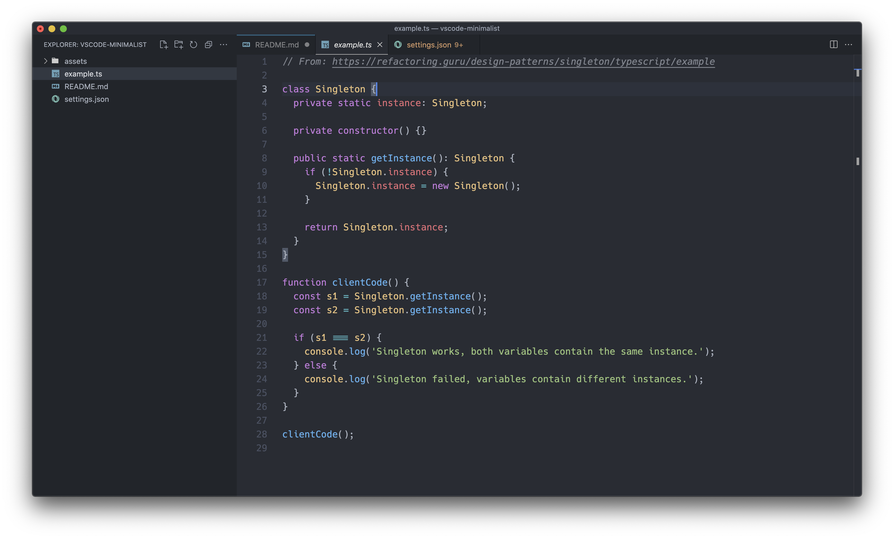
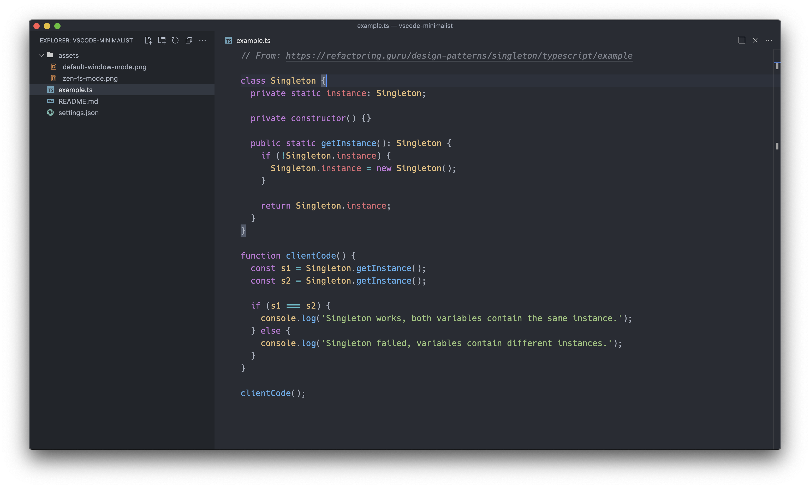

# vscode-minimalist

Simple, distraction free preset for VSCode.

## TODO

- [ ] Remove Explorer Actions
- [ ] Remove Editor Actions
- [ ] Remove Selection Map in the scrollbar
- [ ] Customize terminal
- [ ] Extension

## Example

Default window mode:

Zen window mode:

